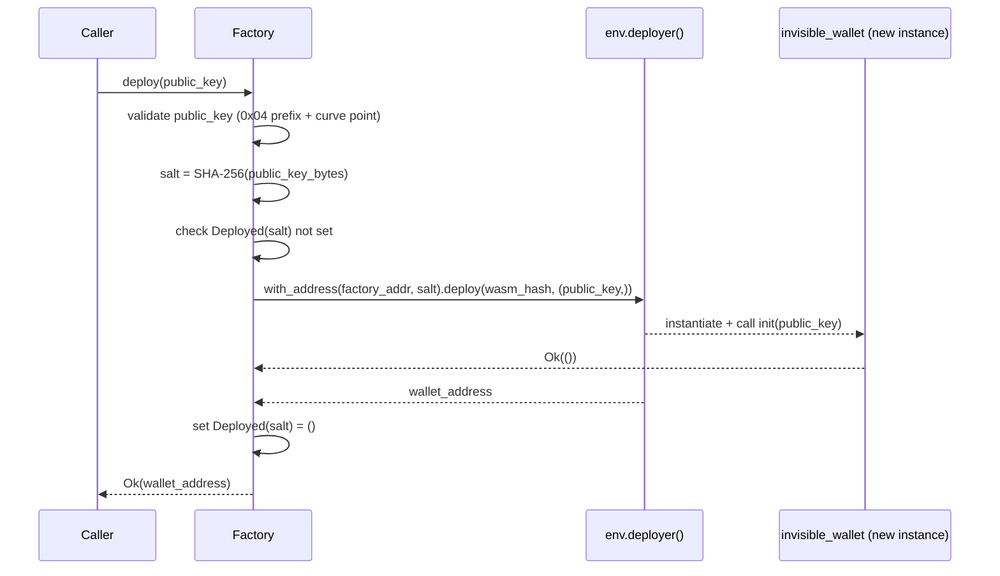

# Design Document: factory-contract

## Overview

The factory contract is a permissionless Soroban smart contract that deploys `invisible_wallet` instances on demand. Any caller supplies a 65-byte uncompressed P-256 public key; the factory validates it, derives a deterministic salt, deploys the wallet Wasm, and calls `init` on the new instance — returning its `Address`. Because the salt is `SHA-256(public_key_bytes)`, the resulting contract address is fully predictable off-chain before any transaction is submitted.

The factory itself is a thin orchestrator: it holds one piece of persistent state (the `wasm_hash` of the wallet contract) and delegates all wallet logic to the deployed instances.

## Architecture



Key design decisions:

- **Single-call deployment**: `env.deployer().with_address(...).deploy(wasm_hash, (public_key,))` instantiates the contract and calls `init` atomically — no window where a wallet exists but is uninitialized.
- **Permissionless**: `deploy` has no `require_auth` guard — anyone can deploy a wallet for any key.
- **Explicit duplicate tracking**: The factory stores a `Deployed(salt)` key in instance storage before calling the deployer, so duplicate detection returns a clean `FactoryError::AlreadyDeployed` rather than relying on a host-level trap.
- **Operator-controlled Wasm**: `init` is callable once and stores the `wasm_hash`; wallet Wasm upgrades are outside this factory's scope.

## Components and Interfaces

### Factory Contract (`contracts/factory/src/lib.rs`)

```rust
#[contract]
pub struct Factory;

#[contractimpl]
impl Factory {
    /// One-time initialization. Stores the wallet Wasm hash.
    pub fn init(env: Env, wasm_hash: BytesN<32>) -> Result<(), FactoryError>;

    /// Deploy a new invisible_wallet for the given P-256 public key.
    /// Returns the Address of the newly deployed wallet.
    pub fn deploy(env: Env, public_key: BytesN<65>) -> Result<Address, FactoryError>;
}
```

### Error Enum

```rust
#[contracterror]
#[derive(Copy, Clone, Debug, Eq, PartialEq)]
#[repr(u32)]
pub enum FactoryError {
    AlreadyInitialized = 1,
    NotInitialized     = 2,
    AlreadyDeployed    = 3,
    InvalidPublicKey   = 4,
}
```

### Storage Module (`contracts/factory/src/storage.rs`)

Mirrors the pattern from `invisible_wallet/src/storage.rs`:

```rust
#[contracttype]
pub enum DataKey {
    WasmHash,
    Deployed(BytesN<32>),  // keyed by salt; presence = wallet exists
}

pub fn set_wasm_hash(env: &Env, hash: &BytesN<32>);
pub fn get_wasm_hash(env: &Env) -> Option<BytesN<32>>;
pub fn has_wasm_hash(env: &Env) -> bool;
pub fn mark_deployed(env: &Env, salt: &BytesN<32>);
pub fn is_deployed(env: &Env, salt: &BytesN<32>) -> bool;
```

`WasmHash` and `Deployed(salt)` both use `env.storage().instance()` — the factory contract's instance storage persists for the lifetime of the factory.

### Validation Module (`contracts/factory/src/validation.rs`)

```rust
/// Returns Ok(()) if public_key is a valid uncompressed P-256 point.
/// Checks: first byte == 0x04, then VerifyingKey::from_sec1_bytes.
pub fn validate_public_key(public_key: &BytesN<65>) -> Result<(), FactoryError>;
```

Reuses the `p256` crate already in the workspace. `VerifyingKey::from_sec1_bytes` rejects both bad-prefix and off-curve inputs, so a single call covers both validation cases.

## Data Models

### On-chain State

| Key                       | Storage tier | Type         | Description                                          |
| ------------------------- | ------------ | ------------ | ---------------------------------------------------- |
| `DataKey::WasmHash`       | `instance`   | `BytesN<32>` | SHA-256 of the wallet Wasm blob                      |
| `DataKey::Deployed(salt)` | `instance`   | `()`         | Presence indicates wallet for this salt was deployed |

No per-wallet state is stored in the factory. All wallet state lives inside each deployed wallet instance.

### Salt Derivation

```
salt: BytesN<32> = SHA-256( public_key.to_array() )   // 65 bytes in → 32 bytes out
```

Computed using the `sha2` crate (already a workspace dependency). The same computation performed off-chain with any SHA-256 implementation produces an identical salt, enabling address pre-computation.

### Address Derivation

Soroban derives the contract address deterministically from the deployer address, salt, and wasm hash. Because the factory's own address and the stored wasm hash are fixed for a given factory deployment, the wallet address is a pure function of `public_key`:

```
wallet_address = soroban_address( factory_address, SHA-256(public_key_bytes), wasm_hash )
```

### `deploy` Control Flow

```
deploy(public_key):
  1. get_wasm_hash()  → None  → Err(NotInitialized)
  2. validate_public_key(public_key)  → Err  → Err(InvalidPublicKey)
  3. salt = SHA-256(public_key_bytes)
  4. is_deployed(salt)  → true  → Err(AlreadyDeployed)
  5. addr = env.deployer()
               .with_address(env.current_contract_address(), salt)
               .deploy_v2(wasm_hash, (public_key,))
  6. mark_deployed(salt)
  7. Ok(addr)
```

## Correctness Properties

_A property is a characteristic or behavior that should hold true across all valid executions of a system — essentially, a formal statement about what the system should do. Properties serve as the bridge between human-readable specifications and machine-verifiable correctness guarantees._

### Property 1: Valid key produces a deployed wallet

_For any_ valid uncompressed P-256 public key, calling `deploy` on an initialized factory must succeed and return an `Address` at which a contract now exists.

**Validates: Requirements 1.2, 1.4**

### Property 2: Deployed wallet has the key registered as signer (round-trip)

_For any_ valid P-256 public key, after a successful `deploy`, calling `has_signer` on the returned wallet address with that same public key must return `true`.

**Validates: Requirements 1.3**

### Property 3: Address is deterministic from the public key

_For any_ valid P-256 public key, the `Address` returned by `deploy` must equal the address computed off-chain using `SHA-256(public_key_bytes)` as the salt with the same deployer address and wasm hash.

**Validates: Requirements 2.1, 2.2, 2.3**

### Property 4: Duplicate deploy returns AlreadyDeployed

_For any_ valid P-256 public key, calling `deploy` a second time with the same key must return `Err(FactoryError::AlreadyDeployed)` and must not alter the existing wallet.

**Validates: Requirements 3.1, 3.2, 3.3**

### Property 5: Malformed public key returns InvalidPublicKey

_For any_ 65-byte array that either (a) has a first byte other than `0x04`, or (b) has the `0x04` prefix but does not represent a valid point on the P-256 curve, calling `deploy` must return `Err(FactoryError::InvalidPublicKey)`.

**Validates: Requirements 4.1, 4.2**

### Property 6: Double init returns AlreadyInitialized

_For any_ 32-byte wasm hash, calling `init` on an already-initialized factory must return `Err(FactoryError::AlreadyInitialized)`.

**Validates: Requirements 5.2**

### Property 7: Deploy before init returns NotInitialized

_For any_ valid P-256 public key, calling `deploy` on a factory that has not yet been initialized must return `Err(FactoryError::NotInitialized)`.

**Validates: Requirements 5.3**

## Error Handling

| Condition                                              | Error                | Entry point |
| ------------------------------------------------------ | -------------------- | ----------- |
| `init` called when wasm hash already stored            | `AlreadyInitialized` | `init`      |
| `deploy` called before `init`                          | `NotInitialized`     | `deploy`    |
| `deploy` called with first byte ≠ `0x04`               | `InvalidPublicKey`   | `deploy`    |
| `deploy` called with `0x04` prefix but off-curve point | `InvalidPublicKey`   | `deploy`    |
| `deploy` called with a key whose wallet already exists | `AlreadyDeployed`    | `deploy`    |

All errors are returned as `Result<_, FactoryError>` — no `panic!` calls anywhere in the contract. The `#[contracterror]` attribute ensures each variant surfaces as a typed on-chain error code with its `u32` discriminant.

Duplicate detection happens _before_ calling the deployer (via the `Deployed(salt)` storage check), so the factory never reaches the deployer with a colliding address. This avoids relying on a host-level trap for control flow.

## Testing Strategy

### Dual Testing Approach

Both unit tests and property-based tests are required and complementary:

- **Unit tests**: specific examples, integration smoke tests, error discriminant checks
- **Property tests**: universal correctness across randomly generated inputs

### Property-Based Testing Library

Use [`proptest`](https://github.com/proptest-rs/proptest) for Rust. Add to `[dev-dependencies]` in `contracts/factory/Cargo.toml`:

```toml
proptest = "1"
p256 = { version = "0.13", features = ["ecdsa", "std"] }
sha2 = { version = "0.10" }
soroban-sdk = { version = "20.0.0", features = ["testutils"] }
```

Each property test runs a minimum of **100 iterations** (proptest default is 256, which satisfies this).

Each property test must include a tag comment:
`// Feature: factory-contract, Property N: <property_text>`

### Property Test Specifications

**Property 1 — Valid key produces a deployed wallet**

```
// Feature: factory-contract, Property 1: valid key produces a deployed wallet
// Strategy: generate random P-256 SigningKey, extract uncompressed 65-byte public key.
// Assert: factory.deploy(key) returns Ok(addr) and a contract exists at addr.
```

**Property 2 — Deployed wallet has key registered as signer (round-trip)**

```
// Feature: factory-contract, Property 2: deployed wallet has key registered as signer
// Strategy: same key generation as Property 1.
// Assert: after deploy, InvisibleWalletClient::has_signer(addr, key) == true.
```

**Property 3 — Address is deterministic from public key**

```
// Feature: factory-contract, Property 3: address is deterministic from public key
// Strategy: generate random valid key, compute expected salt = SHA-256(key_bytes).
// Assert: address returned by deploy equals address computed via env.deployer()
//         with the same salt (using Soroban testutils address derivation helper).
```

**Property 4 — Duplicate deploy returns AlreadyDeployed**

```
// Feature: factory-contract, Property 4: duplicate deploy returns AlreadyDeployed
// Strategy: generate random valid key, call deploy twice on same factory.
// Assert: second call returns Err(FactoryError::AlreadyDeployed).
```

**Property 5 — Malformed public key returns InvalidPublicKey**

```
// Feature: factory-contract, Property 5: malformed public key returns InvalidPublicKey
// Strategy A (bad prefix): generate random [u8; 65] with first byte != 0x04.
// Strategy B (off-curve): generate [0x04] ++ random [u8; 64] that fails curve check.
// Assert: both strategies return Err(FactoryError::InvalidPublicKey).
```

**Property 6 — Double init returns AlreadyInitialized**

```
// Feature: factory-contract, Property 6: double init returns AlreadyInitialized
// Strategy: generate random BytesN<32> wasm hash, call init twice.
// Assert: second call returns Err(FactoryError::AlreadyInitialized).
```

**Property 7 — Deploy before init returns NotInitialized**

```
// Feature: factory-contract, Property 7: deploy before init returns NotInitialized
// Strategy: fresh factory (no init call), generate random valid key.
// Assert: deploy returns Err(FactoryError::NotInitialized).
```

### Unit Tests

- `test_init_stores_wasm_hash` — call `init`, verify stored hash matches input
- `test_deploy_full_integration` — init factory, deploy wallet, verify address and signer registration
- `test_error_discriminants_unique_nonzero` — assert each `FactoryError` variant casts to a distinct non-zero `u32`
- `test_factory_error_all_variants_present` — compile-time check that `AlreadyInitialized`, `NotInitialized`, `AlreadyDeployed`, `InvalidPublicKey` all exist

### Test File Layout

```
contracts/factory/
  src/
    lib.rs          # Factory contract, FactoryError, #[cfg(test)] module
    storage.rs      # DataKey, get/set/has/mark helpers
    validation.rs   # validate_public_key
  Cargo.toml
```

Tests live in `#[cfg(test)]` modules inside `lib.rs`, following the same pattern as `invisible_wallet/src/lib.rs`.
